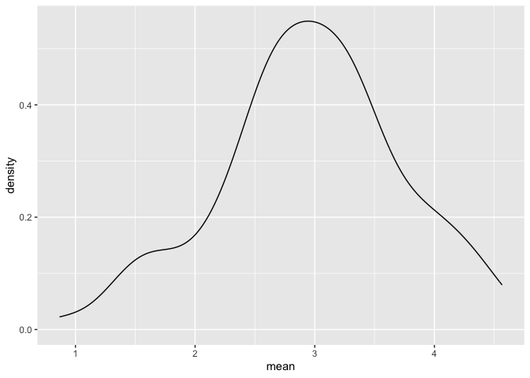
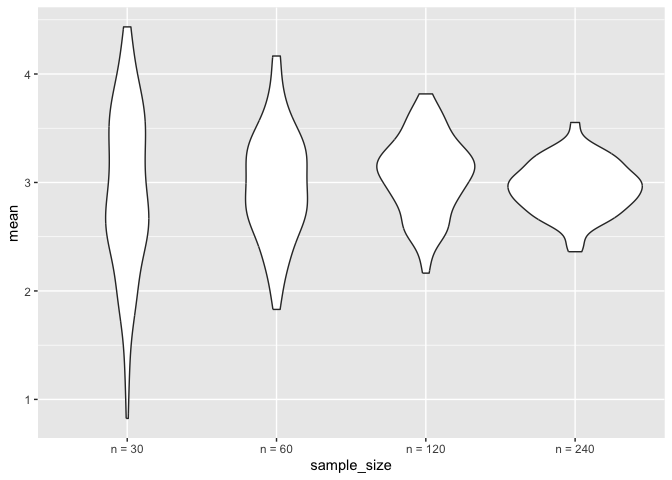

20241031_Simulation
================
2024-11-04

Why simulations? Central limit theorem, drawing independent samples and
samples from a population eventually will average of the sample mean
will look closer to population mean repeated sampling (statistical
analysis) does not happen in reality (data expensive to collect) but it
can happen on a computer (can see what really happens under repeated
sampling)

Gives us a way to check whether statistical approach does the thing that
it claims to do

Simulations are natural in the context of iterations

Write a function that - defines data generating mechanisms - draw a
sample - analyse the sample - repeated object of interest (mean,
regression etc)

use loop to repeat

can inspect and understand properties of statistical analysis what
happens when change sample size, what happens when change something in
study design

## Let’s simulate something

sample size has default true mean 3 and true sd 4

``` r
sim_mean_sd = function(samp_size, mu = 3, sigma = 4) {
  
  sim_data = 
    tibble(
      x = rnorm(n = samp_size, mean = mu, sd = sigma) #generates data from a normal dis with this sample size and this mean
    )
  
  sim_data %>% #then taking that data sample, we know the truth of the population
    summarise(
      mean = mean(x),
      sd = sd(x)
    ) #returns sample mean and sd
}
```

Repeating this run (go out into the population, draw sample size of 30,
then give me sample mean and sample sd)

I have a function and i can simulate by running this line

``` r
sim_mean_sd(30)
```

    ## # A tibble: 1 × 2
    ##    mean    sd
    ##   <dbl> <dbl>
    ## 1  2.60  3.53

mean is around 3 and sd is around 4 like the true population This is the
process that we are going to be more rigorous about

Suppose running this over and over again, what would the distribution of
the mean should look like?

(drawing from normal dis population, sample mean should be centered
around true mean and sd of sample mean is the population sd divided by
sample size); establish by statistics

## Let’s stimualte a lot

Not running same line of code over and over again, but doing it formally

Start with a for loop Need to have the output then have the for loop
itself

``` r
output = vector("list", length = 100)

for (i in 1:100) {
  
  output[[i]] = sim_mean_sd(samp_size = 30)
  
} #for each iteration from 1 to 100 i need to do something (run sim_mean_sdw with sample size 30)

#Then need to save the save the output of i

#more manageable if bind rows together 

bind_rows(output)
```

    ## # A tibble: 100 × 2
    ##     mean    sd
    ##    <dbl> <dbl>
    ##  1  3.04  3.17
    ##  2  2.33  3.61
    ##  3  3.30  4.86
    ##  4  1.85  3.98
    ##  5  2.99  2.70
    ##  6  1.79  3.82
    ##  7  2.71  4.14
    ##  8  3.22  3.43
    ##  9  3.24  3.96
    ## 10  2.71  3.41
    ## # ℹ 90 more rows

Looking at this: I have gone out 100 times, each time taking a sample of
30 from a population with a true mean of 3 and sd of 4 Given each sample
compute the mean and sd for each sample

## Let’s use a loop function

In the for loop previously there is an output loop, but there was no
input list.

In the case where we had an input this (for this input do this for this
input do this), we used map Each input in the input list applied to
function to get an output list

Here different, we just want to do the same thing over and over again
–\> rerun rerun(some number of times, some thing)

``` r
sim_results = 
  rerun(100, sim_mean_sd(samp_size = 30)) %>% 
  bind_rows()
```

    ## Warning: `rerun()` was deprecated in purrr 1.0.0.
    ## ℹ Please use `map()` instead.
    ##   # Previously
    ##   rerun(100, sim_mean_sd(samp_size = 30))
    ## 
    ##   # Now
    ##   map(1:100, ~ sim_mean_sd(samp_size = 30))
    ## This warning is displayed once every 8 hours.
    ## Call `lifecycle::last_lifecycle_warnings()` to see where this warning was
    ## generated.

## Let’s take a look at the 100 sample mean and sd results that we got

wrote a function, use rerun, and binding rows

Can start to do data manipulation to this

``` r
sim_results %>% 
  ggplot(aes(x = mean)) + geom_density()
```

<!-- -->

``` r
sim_results %>% 
  summarise(
    avg_samp_mean = mean(mean),
    sd_samp_mean = sd(mean)
  )
```

    ## # A tibble: 1 × 2
    ##   avg_samp_mean sd_samp_mean
    ##           <dbl>        <dbl>
    ## 1          2.96        0.762

This shows the distribution of the sample mean across the 100
experiments (centered around 3 which makes sense as the true population
mean we set was 3)

And the sample sd should be able the population sd / sample size 30 ~
0.7

``` r
sim_results %>% 
  ggplot(aes(x = sd)) + geom_density()
```

<!-- -->

dis of sample sd is about 4 but unlike the dis of sample mean the dis is
not normally dis, there is a heavier tail Through simulation we can
learn more about this dis, about what the shape of the dis of sample sd
looks like in repeated sampling

Here, we had a fixed sample size of 30. Many things in stats depends on
the sample size. What happens when we start changing the sample size?
Does dis of mean get narrower when sample size increases like we expect?

## Let’s try other sample sizes

Starting with for loop, can be easier to start with (now going to have a
input list, since we want to change the input each time a little bit)

``` r
n_list = 
  list(
    "n = 30" = 30,
    "n = 60" = 60,
    "n = 120" = 120,
    "n = 240" = 240
  ) #this is input list, now want that when n is 30 want to run simulation 100 times, then save the results of that, then when n is 60 run again 100 times. Input object does not match output object (but can use listcols)

output = vector("list", length = 4)

output[[1]] = rerun(100, sim_mean_sd(samp_size = n_list[[1]])) %>%
  bind_rows() #running the sim_mean_sd function 100 times and the input that i am putting into it is the first in my input list (30)
```

    ## Warning: `rerun()` was deprecated in purrr 1.0.0.
    ## ℹ Please use `map()` instead.
    ##   # Previously
    ##   rerun(100, sim_mean_sd(samp_size = n_list[[1]]))
    ## 
    ##   # Now
    ##   map(1:100, ~ sim_mean_sd(samp_size = n_list[[1]]))
    ## This warning is displayed once every 8 hours.
    ## Call `lifecycle::last_lifecycle_warnings()` to see where this warning was
    ## generated.

``` r
n_list = 
  list(
    "n = 30" = 30,
    "n = 60" = 60,
    "n = 120" = 120,
    "n = 240" = 240
  ) 

output = vector("list", length = 4)

#Then rather than having to write the first of the input list, the second of the input list, can write a loop 

for(i in 1:4) {
  
  output[[i]] = 
    rerun(100, sim_mean_sd(samp_size = n_list[[i]])) %>%
  bind_rows() 
}
```

    ## Warning: `rerun()` was deprecated in purrr 1.0.0.
    ## ℹ Please use `map()` instead.
    ##   # Previously
    ##   rerun(100, sim_mean_sd(samp_size = n_list[[i]]))
    ## 
    ##   # Now
    ##   map(1:100, ~ sim_mean_sd(samp_size = n_list[[i]]))
    ## This warning is displayed once every 8 hours.
    ## Call `lifecycle::last_lifecycle_warnings()` to see where this warning was
    ## generated.

``` r
# in the last for loop since we have a input list and an output list we can convert this into a map 
```

Putting this into a simpler process (using rerun, map, mutate functions)

Key idea is that i have 4 different sample sizes, and for each sample
size i want 100 samples and then get the results

I want this in a dataframe columns First column telling me what sample
size Second column telling me given my sample size input what the
simulation results are

mutate allows me to add columns map (mapping across the input list that
i care about = sample size) and the function that i want to apply on the
input list is rerun(100, sim_mean_sd()

map(sample_size, rerun(100, sim_mean_sd()))

But want to be really specific in the map function about where my input
sample size is going. Calling sample size .x and telling it that in the
function you can put .x where you want the input to specifically go
indexing / being v specific about where the sample size argument goes in
rerun function

``` r
tibble(
  sample_size = c(30, 60, 120, 240)
) %>% 
  mutate(
    output_lists = map(.x = sample_size, ~ rerun(10, sim_mean_sd(.x)))
  )
```

    ## Warning: There was 1 warning in `mutate()`.
    ## ℹ In argument: `output_lists = map(.x = sample_size, ~rerun(10,
    ##   sim_mean_sd(.x)))`.
    ## Caused by warning:
    ## ! `rerun()` was deprecated in purrr 1.0.0.
    ## ℹ Please use `map()` instead.
    ##   # Previously
    ##   rerun(10, sim_mean_sd(.x))
    ## 
    ##   # Now
    ##   map(1:10, ~ sim_mean_sd(.x))

    ## # A tibble: 4 × 2
    ##   sample_size output_lists
    ##         <dbl> <list>      
    ## 1          30 <list [10]> 
    ## 2          60 <list [10]> 
    ## 3         120 <list [10]> 
    ## 4         240 <list [10]>

can do %\>% pull(output_lists) at the end to see the expanded outcome,
see every entry my input list

``` r
tibble(
  sample_size = c(30, 60, 120, 240)
) %>% 
  mutate(
    output_lists = map(.x = sample_size, ~ rerun(10, sim_mean_sd(.x))),
    estimate_df = map(output_lists, bind_rows)
  )
```

    ## # A tibble: 4 × 3
    ##   sample_size output_lists estimate_df      
    ##         <dbl> <list>       <list>           
    ## 1          30 <list [10]>  <tibble [10 × 2]>
    ## 2          60 <list [10]>  <tibble [10 × 2]>
    ## 3         120 <list [10]>  <tibble [10 × 2]>
    ## 4         240 <list [10]>  <tibble [10 × 2]>

estimate_df column gives me a third column that contain tibbles of my
collection of 10 sample means and sd

``` r
tibble(
  sample_size = c(30, 60, 120, 240)
) %>% 
  mutate(
    output_lists = map(.x = sample_size, ~ rerun(10, sim_mean_sd(.x))),
    estimate_df = map(output_lists, bind_rows)
  ) %>% 
  select(-output_lists) #since do not need output list
```

    ## # A tibble: 4 × 2
    ##   sample_size estimate_df      
    ##         <dbl> <list>           
    ## 1          30 <tibble [10 × 2]>
    ## 2          60 <tibble [10 × 2]>
    ## 3         120 <tibble [10 × 2]>
    ## 4         240 <tibble [10 × 2]>

``` r
listcol_sim_results = 
  tibble(
    sample_size = c(30, 60, 120, 240)
  ) %>% 
  mutate(
    output_lists = map(.x = sample_size, ~ rerun(100, sim_mean_sd(.x))),
    estimate_df = map(output_lists, bind_rows)
  ) %>% 
  select(-output_lists) %>% 
  unnest(estimate_df)
```

    ## Warning: There was 1 warning in `mutate()`.
    ## ℹ In argument: `output_lists = map(.x = sample_size, ~rerun(100,
    ##   sim_mean_sd(.x)))`.
    ## Caused by warning:
    ## ! `rerun()` was deprecated in purrr 1.0.0.
    ## ℹ Please use `map()` instead.
    ##   # Previously
    ##   rerun(100, sim_mean_sd(.x))
    ## 
    ##   # Now
    ##   map(1:100, ~ sim_mean_sd(.x))

now expanded out the estimate_df column, have 10 rows for sample size
30, for 60, 120, 240

Can change how many times we repeated the sample size 30, 60, 120, 240
sample size; change number in rerun

## Can do now some data frame things

``` r
listcol_sim_results %>% 
  mutate(
    sample_size = str_c("n = ", sample_size) #making a new label for my sample size called n = 30, 60
    , sample_size = fct_inorder(sample_size)
  ) %>% 
  ggplot(aes(x = sample_size, y = mean)) + 
  geom_boxplot()
```

<!-- -->

``` r
listcol_sim_results %>% 
  mutate(
    sample_size = str_c("n = ", sample_size) #making a new label for my sample size called n = 30, 60
    , sample_size = fct_inorder(sample_size)
  ) %>% 
  ggplot(aes(x = sample_size, y = mean)) + 
  geom_violin()
```

<!-- -->

``` r
listcol_sim_results %>% 
  group_by(sample_size) %>% 
  summarise(
    avg_samp_mean = mean(mean),
    sd_samp_mean = sd(mean)
  )
```

    ## # A tibble: 4 × 3
    ##   sample_size avg_samp_mean sd_samp_mean
    ##         <dbl>         <dbl>        <dbl>
    ## 1          30          2.93        0.749
    ## 2          60          2.98        0.502
    ## 3         120          3.07        0.358
    ## 4         240          2.95        0.239

## Changing underlying population

The underlying population does not have to be a normal distribution

It can be a binomial distribution

``` r
sim_mean_sd = function(samp_size, mu = 3, sigma = 4) {
  
binom_sim_data = 
    tibble(
      x = rbinom(n = samp_size, mean = mu, sd = sigma) #generates data from a normal dis with this sample size and this mean
    )
  
  sim_data %>% #then taking that data sample, we know the truth of the population
    summarise(
      mean = mean(x),
      sd = sd(x)
    ) #returns sample mean and sd
}
```

Getting some idea of how large np needs to use normal approximation

In knitting, can cache results (meaning that since knitting runs the
code, if the simulation takes a long time to run, can cache = in the
setup to tell that r code chunck to still save but hold off in running
the code)

In r setup can set the seed (set.seed(1)), meaning that everytime i knit
this the random numbers generated are randomly generated but are the
same as the last time that i knitted it
